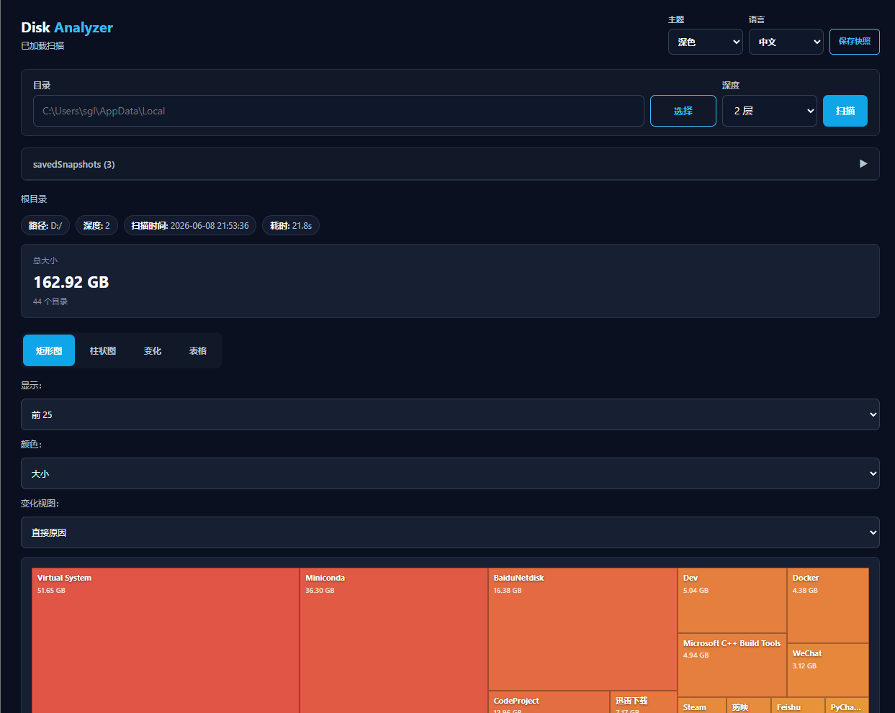
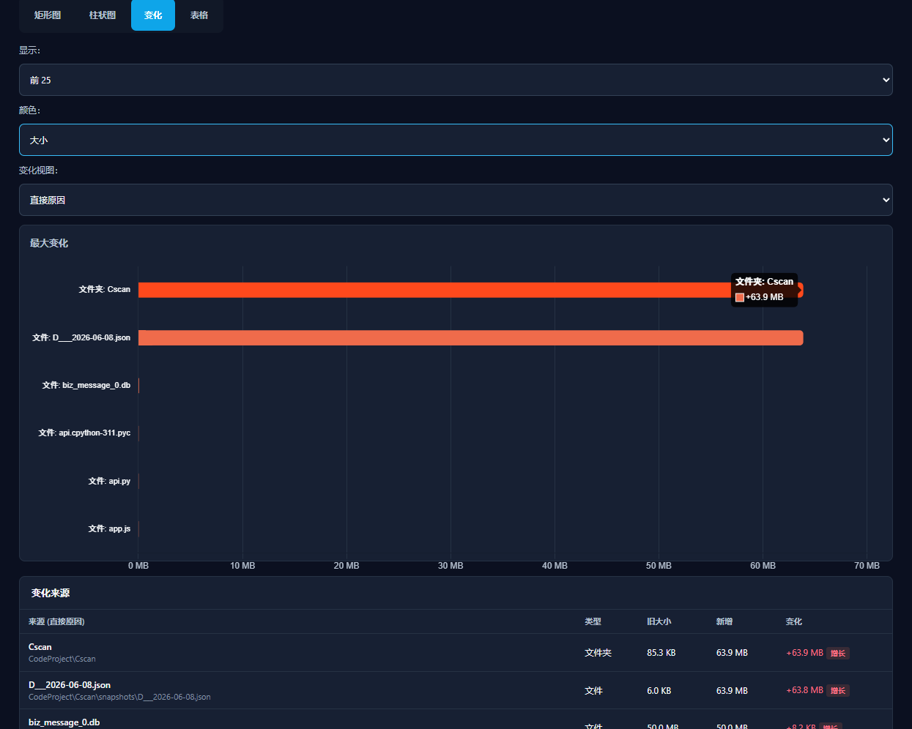

# Disk Analyzer

Disk Analyzer is a lightweight Windows desktop tool for scanning disk usage,
visualizing directory size, saving snapshots, and comparing storage changes over
time.

It uses Python + pywebview for the desktop shell and a single-page HTML/CSS/JS
frontend for charts, treemap rendering, snapshots, themes, and language
switching.

## Features

- Scan any local directory with configurable depth.
- Pick a directory with a native folder picker or type the path manually.
- View disk usage as an interactive treemap.
- Drill down into folders from the treemap or breadcrumb.
- View largest directories with horizontal bar charts.
- Save scan results as JSON snapshots.
- Compare two snapshots from the same path.
- Show direct change causes, folder summaries, or full change details.
- Track file-level changes in newly created snapshots.
- Switch between dark and light themes.
- Switch UI language between English and Chinese.
- Build a standalone Windows `.exe` with PyInstaller.

## Preview

### Main Dashboard



### Snapshot Changes



## Requirements

- Windows 10/11
- Python 3.8+
- Internet access for the Chart.js CDN

Python dependencies:

```powershell
pip install pywebview
```

For building an executable:

```powershell
pip install pyinstaller
```

## Quick Start

Clone the repository and enter the project directory:

```powershell
git clone https://github.com/<your-name>/<your-repo>.git
cd <your-repo>
```

Install dependencies:

```powershell
pip install pywebview
```

Run from source:

```powershell
python main.py
```

## Usage

1. Enter a directory path or click **Browse** to select one.
2. Select scan depth.
3. Click **Scan**.
4. Inspect the treemap, bar chart, and table views.
5. Click folders in the treemap or table to drill down.
6. Click **Save Snapshot** to save the current scan.
7. Open **Saved Snapshots**, select two snapshots from the same path, and click
   **Compare**.
8. Use **Change View** to switch between:
   - **Direct causes**: shows the most direct file/folder changes.
   - **Folders summary**: shows folder-level changes only.
   - **All details**: shows full file/folder change propagation.

## Snapshot Storage

When running from source, snapshots are saved in:

```text
snapshots/
```

When running the packaged executable, snapshots are saved next to the `.exe`:

```text
dist/snapshots/
```

Snapshots are JSON files containing:

- scanned path
- scan depth
- timestamp
- directory size map
- file size map for newly created snapshots

Local snapshots are user data and usually should not be committed to Git.

## Build Windows Executable

Run the build script:

```powershell
.\build.bat
```

The executable will be created at:

```text
dist/DiskAnalyzer.exe
```

Manual build command:

```powershell
pyinstaller --noconfirm --onefile --windowed --name DiskAnalyzer --add-data "index.html;." --add-data "static;static" main.py
```

## Project Structure

```text
DiskAnalyzer/
|-- api.py              # pywebview API, snapshots, folder picker
|-- scanner.py          # disk scanning logic
|-- main.py             # desktop app entry point
|-- index.html          # frontend HTML shell
|-- pic/                # README screenshots
|-- static/
|   |-- app.js          # frontend state, charts, i18n, themes
|   `-- styles.css      # app styling and theme tokens
|-- snapshots/          # generated local snapshot files
|-- build.bat           # PyInstaller build script
`-- README.md
```

## Development Notes

- The app currently targets Windows.
- Chart rendering depends on Chart.js loaded from CDN.
- Old snapshots created before file-level scanning may only contain directory
  size data.
- Snapshot comparison requires both snapshots to come from the same directory
  path.
- Generated folders such as `__pycache__/`, `dist/`, `build/`, and local
  snapshot files should normally be ignored by Git.

## Suggested `.gitignore`

```gitignore
__pycache__/
*.pyc
build/
dist/
*.spec
snapshots/*.json
```

## License

Choose a license before publishing, for example MIT:

```text
MIT License
```
